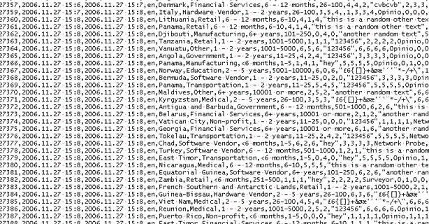

# Sales-Data-Analysis-Pyspark-Databricks
Analyze and visualize sales data from two files using PySpark and Databricks, generating insightful visualizations for better understanding and decision-making.

Overview
This repository contains Python code leveraging PySpark and Databricks to conduct comprehensive sales data analysis. The aim is to explore, process, and visualize data from two raw files, extracting valuable insights to aid in business decisions.

Before analysis:

{Some Magic}

After analysis:

